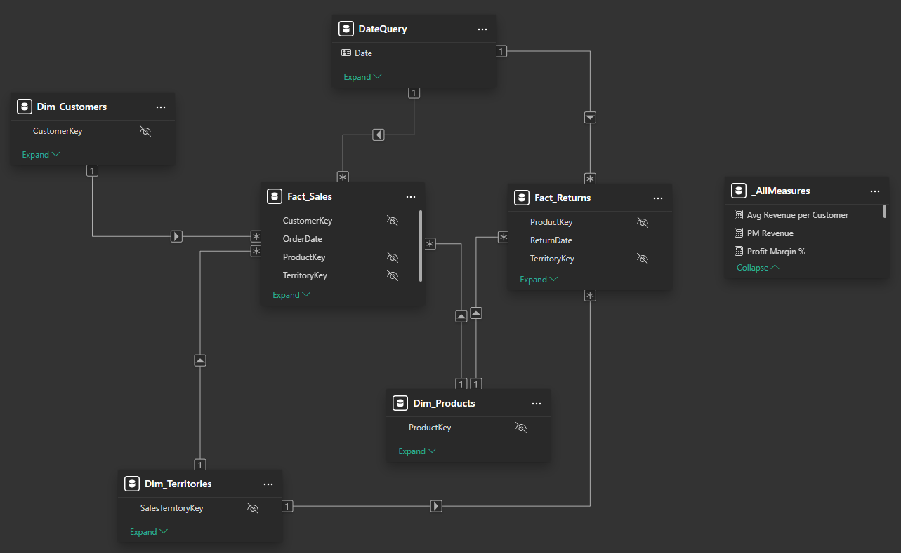
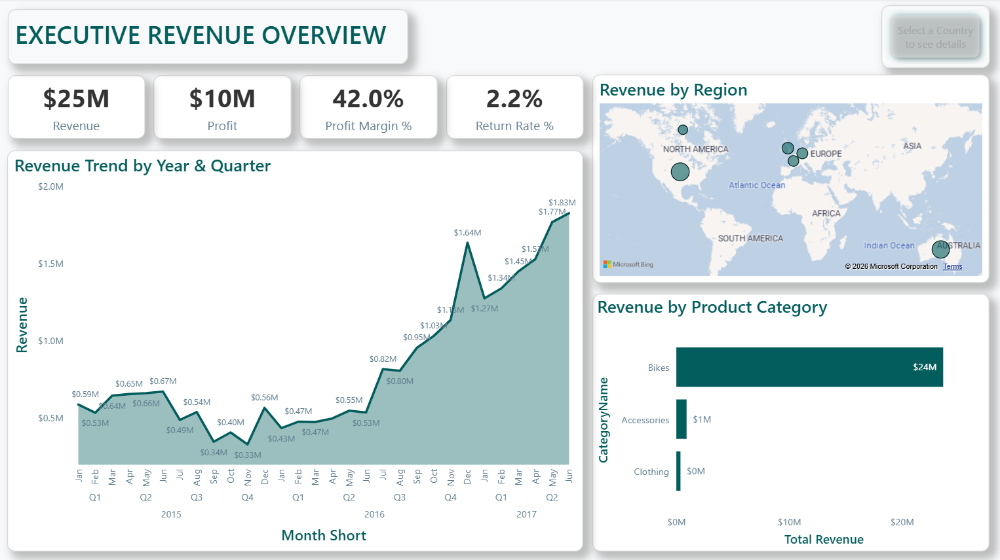
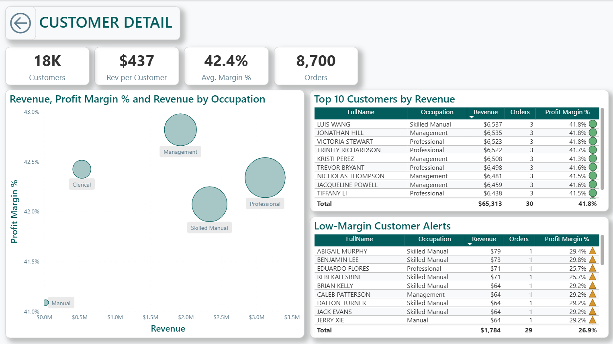

# AdventureWorks Commercial Executive Suite


## Executive Summary
This project is a **senior-level Business Intelligence solution** designed to provide the AdventureWorks leadership team with a dual-layered view of global operations. It moves beyond static reporting by implementing **contextual drill-throughs**, **dynamic UI navigation**, and **customer behavioral segmentation**.

The suite is engineered to bridge the gap between high-level regional performance and granular customer-level profitability, allowing stakeholders to identify "profit leakage" and high-value growth opportunities in real-time.

---

## How to Use This Repository
1. Clone or download the repository.
2. Open `AdventureWorks Commercial Executive Suite.pbix`.
3. Update the `FolderPath` parameter to point to the `/Data` folder.
4. Refresh the model in Power BI Desktop.

---

## Business Case & Problem Statement

### The Challenge
The AdventureWorks leadership team struggled with "Information Silos." While they could monitor global revenue, they lacked the ability to answer critical strategic questions:
*  **Segment Profitability:** Which customer occupations drive the highest margins versus the highest volume?
*  **Regional Drill-Down:** Why are certain countries underperforming in net margin despite high sales figures?
*  **Customer Risk:** Which high-volume accounts are actually "Low-Margin" risks requiring contract renegotiation?

### The Solution
I engineered a **Star Schema** data model and a multi-page interactive suite to:
* **Standardize Global KPIs:** Centralized tracking of Revenue, Orders, and Profit Margin % across all territories.
* **Deploy Strategic Segmentation:** Utilized a Scatter-Plot matrix to visualize the relationship between Occupation, Revenue, and Profitability.
* **Automate Risk Alerts:** Built targeted logic to highlight accounts falling below the 30% margin threshold.

---

## Technical Architecture

### 1. Data Engineering (Star Schema)


Transformed raw, disconnected CSV files into a high-performance normalized model using **Power Query (M)**.
* **Decoupled Logic:** All ETL scripts are extracted and version-controlled as standalone `.m` files.
* **Dynamic Portability:** Implemented a `FolderPath` parameter to ensure the model refreshes seamlessly in any local or cloud environment.
* **Normalized Structure:** Built a clean Star Schema consisting of a central `Fact_Sales` table connected to `Dim_Customers`, `Dim_Products`, `Dim_Territories`, and `Dim_Calendar`.

### 2. DAX Measures
Engineered robust calculations that maintain accuracy across complex filter contexts and drill-through paths.

#### **A. Profit Margin %**
*The primary health metric for the organization, used for conditional formatting alerts.*
```dax
Profit Margin % = 
DIVIDE(
    [Total Profit], 
    [Total Revenue], 
    0
)
```

### **B. Average Revenue per Customer**
*A dynamic calculation reflecting unique customer spend relative to the current filter context.*
```dax
Avg Revenue per Customer = 
DIVIDE(
    [Total Revenue], 
    [Total Customers], 
    0
)
```

### **C. Total Orders**
*Utilizes `DISTINCTCOUNT` to ensure order volume is not inflated by multi-line item orders.*
```dax
Total Orders = DISTINCTCOUNT(Fact_Sales[OrderNumber])
```

---

## Key Insights & Dashboard Features

### 1. The Global Command Center
* **Geospatial Intelligence:** Interactive map allowing executives to select a country to synchronize the entire global suite.
* **Strategic Drill-Through:** A custom-engineered navigation button that carries geographical "context" into a hidden deep-dive analysis page.

### 2. Customer Strategy Deep-Dive
* **Occupation Segmentation:** Analyzes the "Professional" vs. "Management" segments to optimize marketing allocation.
* **Management by Exception:** A dual-table layout contrasting "Top 10 High-Value Customers" against "Low-Margin Alerts."

### 3. Mobile Executive View
* **Thumb-Optimized Design:** A dedicated mobile-responsive layout featuring high-readability KPI cards and large touch targets for on-the-go decision-making.

---

## Report Pages Preview

### Executive Overview


### Customer Detail


---

## Skills Demonstrated
- Executive Dashboard Design
- Commercial & Margin Analysis
- Power BI Data Modeling (Star Schema)
- Advanced DAX & Filter Context Management
- Power Query (M) ETL Engineering
- Mobile-Responsive BI Design

---

## Repository Structure
* **Data:** Source CSV files used in the analysis.
* **Power_query:** .m scripts documenting the full ETL process.
* **Visuals:** High-resolution screenshots of the dashboard, mobile layout, and data model.
* **AdventureWorks Commercial Executive Suite.pbix:** The master Power BI source file.

---

## About Me
**Muntasir Abu Roumi**  
Senior Analytics & Planning Professional | PL-300 Certified  
Specialized in Commercial Intelligence, Pricing Strategy, and Executive BI Solutions

[LinkedIn Profile](https://www.linkedin.com/in/muntasir-abu-roumi)

---

## License
This project is licensed under the MIT License - see the LICENSE file for details.
